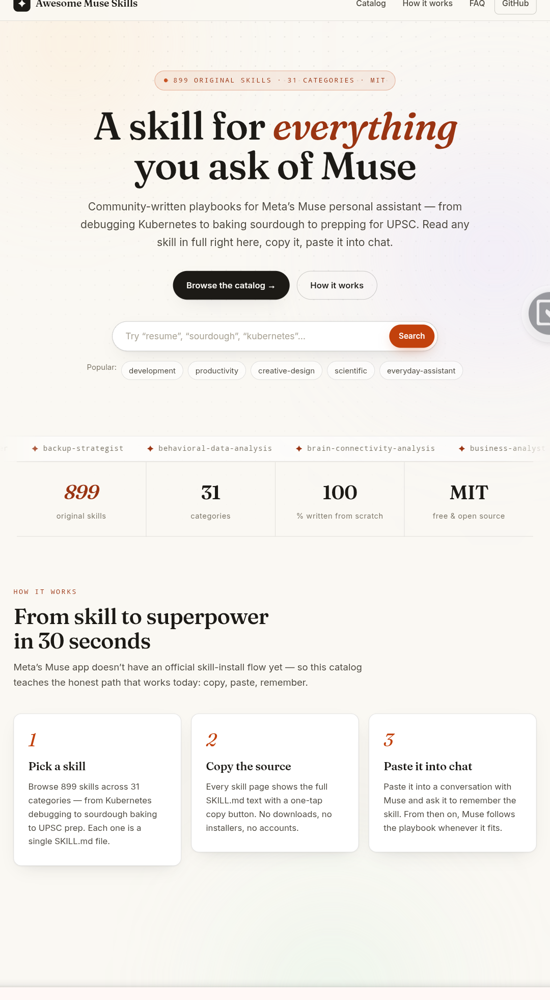

# Awesome Muse Skills

A community catalog of **agent skills for Meta's Muse** personal assistant — **899 original skills** written from scratch, plus **1,485 curated imports**: the best open-source skills from across GitHub, safety-reviewed and republished here with attribution. Free to use.

🌐 **Browse it live: [aimuse-rho.vercel.app](https://aimuse-rho.vercel.app/)** — search all 2,384 skills, read any `SKILL.md` in full, and copy it with one tap.

> ⭐ **If this project helps you, please star it** — stars are the simplest way to support the project and help others discover it.

> 🤝 **Sister project: [museaicodes.com](https://museaicodes.com)** — the guide hub for Meta's Muse AI (guides, comparisons, tools). New users can redeem a referral code toward a promotional token offer (up to 1 billion tokens; eligibility and amounts vary — confirm current terms in the app): `3C77QC` · `N8DCUB`.

*Keywords: awesome list, awesome-list, claude skills, agent skills, ai skills, ai agents, llm skills, meta muse, meta ai, personal ai assistant, prompt engineering, productivity, skill.md, agent skills format*

## What are Muse skills?

A skill is a portable markdown file (`SKILL.md`) that teaches an AI assistant a reusable workflow: when to trigger it, what steps to follow, and what good output looks like. Skills use the open Agent Skills format — YAML frontmatter (`name` + `description`) followed by markdown instructions — so the same skill works across assistants that support the format, including Meta's Muse.

## Quickstart

No installers, no packages. Meta's Muse doesn't have an official skill-install flow yet, so using a skill takes seconds right in chat:

1. **Open the skill** — on the [website catalog](https://aimuse-rho.vercel.app/) or on GitHub at `skills/<name>/SKILL.md`.
2. **Paste the `SKILL.md` content into a chat with Muse**, and add: *"Please use this skill whenever I ask about \<topic\>. Remember it for our future conversations."*
3. **That's it.** A skill is just text instructions — Muse follows them for relevant tasks, and you approve anything it does.

New to skills? Start with [`getting-started-with-muse-skills`](skills/getting-started-with-muse-skills/SKILL.md), which explains the format and the workflow in full. When Meta ships native skill support, these `SKILL.md` files are already in the right format.

## Catalog

**899 original skills across 31 categories.** Browse and search them all on the [website catalog](https://aimuse-rho.vercel.app/) — the table below is a category-level summary.

| Category | Skills | Scope |
|---|---|---|
| ai-maestro | 6 | Agent fleet management — planning, memory search, agent messaging, docs search, code-graph query |
| ai-research | 145 | LLM & agent R&D — frameworks, RAG, evals, alignment, model and inference-provider guides |
| analytics | 1 | Product analytics with Google Analytics 4 |
| business-marketing | 48 | Marketing & business playbooks — SEO, content, growth, sales, PR, finance |
| career | 21 | Career tooling — resumes, interviews, negotiation, leadership |
| creative-design | 33 | Design practice — UI/UX, brand, typography, illustration, handoff |
| curviate | 9 | SaaS platform operations — onboarding, APIs, automations, analytics (vendor-neutral) |
| database | 13 | Databases — SQL/NoSQL modeling, tuning, ORMs, MCP access patterns |
| development | 205 | Software engineering — languages, frontend, backend, DevOps, data/AI, practices |
| document-processing | 18 | Document workflows — PDF, Office formats, OCR, parsing, translation |
| doordash | 5 | On-demand delivery & ordering platform patterns (vendor-neutral) |
| enterprise-communication | 33 | Team communication — chat, email, SMS, meetings, webinars, incident comms |
| everyday-assistant | 14 | Everyday life with a personal AI assistant — briefings, inbox, calendar, travel, meals, habits, reviews |
| git | 3 | Git mastery — branching, commit messages, worktrees |
| marketing | 1 | Ethical social-media scraping patterns |
| media | 5 | Media processing — image, video, audio, FFmpeg, Pillow |
| muse | 1 | Muse-specific — getting started with skills on Meta's Muse assistant |
| open-banking-io | 1 | Open-banking concepts — AIS/PIS flows, consent, PSD2 |
| operations | 6 | SRE & operations — SLOs, incidents, on-call, runbooks, chaos engineering |
| pocketbase | 6 | PocketBase backend — auth, realtime, migrations, hooks, deploy |
| productivity | 53 | Productivity systems — notes, tasks, focus, OS tooling, workspaces |
| railway | 12 | PaaS deployment patterns — deploys, managed data, networking, cost control (vendor-neutral) |
| scientific | 135 | Scientific computing — life sciences, physical sciences, research communication |
| security | 50 | App & infra security — AppSec, SOC, identity, network, GRC (defensive framing) |
| sentry | 6 | Application observability — error tracking, performance, alerts, releases (vendor-neutral) |
| sports | 1 | Statistical sports match-prediction methodology |
| utilities | 12 | Everyday utilities — QR, regex, JSON, UUID, cron, diff |
| video | 4 | Video workflows — editing, screen recording, subtitles, thumbnails |
| web-data | 5 | Web data extraction — scraping, browser automation, SERP APIs |
| web-development | 30 | Modern web development — frameworks, UI, auth, performance, accessibility |
| workflow-automation | 17 | Automation — n8n, GitHub Actions, GitOps, platform APIs, skill curation |

Every skill is an original work: `skills/<name>/SKILL.md` with `name`, `description`, and `category` frontmatter, validated by `scripts/validate.py`. The machine-readable index is [`skills.json`](skills.json).

## Curated imports — 1,485 skills from the ecosystem

Alongside the originals, this repo republishes **1,485 curated third-party skills** in [`skills-imported/`](skills-imported/), with per-skill attribution (source repo + license) in [`skills-imported.json`](skills-imported.json) and on every skill's page on the website. Every import was individually safety-scanned (no exfiltration, no installers, no prompt-injection payloads); permissive licenses (MIT / Apache-2.0) are preserved per skill.

Notable sources include [affaan-m/ECC](https://github.com/affaan-m/ECC) (design taste, video, content, research, build quality), [pbakaus/impeccable](https://github.com/pbakaus/impeccable) (frontend design commands + craft floor), [higgsfield-ai/skills](https://github.com/higgsfield-ai/skills) (AI media generation), [emilkowalski/skills](https://github.com/emilkowalski/skills) (animation & UI craft), [vercel-labs/agent-skills](https://github.com/vercel-labs/agent-skills), [openai/skills](https://github.com/openai/skills), and hundreds more open-source collections. Where the original source couldn't be determined from the skill file, the entry is marked as a curated import — the full original text is preserved so you can trace it.

> **License note:** original skills in `skills/` are MIT (this repo). Imported skills in `skills-imported/` keep **their own original licenses** — check the attribution line on each skill before reuse.

## Ecosystem links

Collections worth knowing that are **not** copied here (linked for reference):

- **[anthropics/skills](https://github.com/anthropics/skills)** — Anthropic's official Agent Skills reference (document skills, creative tools, the Agent Skills spec).
- **[davila7/claude-code-templates](https://github.com/davila7/claude-code-templates)** — the 800+ skill catalog behind [aitmpl.com](https://www.aitmpl.com/skills/), installable via CLI.
- **[harshsinghmp/skills](https://github.com/harshsinghmp/skills)** — community aggregator hub syncing 170+ agent skills from multiple upstreams, installable via `npx skills add`.
- **[vercel-labs/agent-skills](https://github.com/vercel-labs/agent-skills)** — Vercel's official skills for React and web-design best practices.
- **[google-gemini/gemini-skills](https://github.com/google-gemini/gemini-skills)** — Google's official Gemini skills.
- **[openai/skills](https://github.com/openai/skills)** — OpenAI's skills catalog for Codex agents.
- **[microsoft/skills](https://github.com/microsoft/skills)** — Microsoft's official skills (Azure, enterprise dev patterns).
- **[huggingface/skills](https://github.com/huggingface/skills)** — Hugging Face's official skills for models, datasets, and inference.

## Roadmap

- [x] Complete original catalog — 899 skills across 31 categories (done 2026-09-26)
- [x] Curated imports — 1,485 third-party skills, safety-reviewed, republished with attribution (done 2026-09-27)
- The [website catalog](https://aimuse-rho.vercel.app/) — browse, search, and preview skills online (live)
- Community submissions — see [CONTRIBUTING.md](CONTRIBUTING.md)

## Contributing

We welcome new skills and improvements! Please read [CONTRIBUTING.md](CONTRIBUTING.md) first — every submission must pass `scripts/validate.py` and the safety rules.

Ways to contribute:

- ✨ **Add a skill** — write an original `SKILL.md` following the format guide and open a PR.
- 🐛 **Fix or improve** an existing skill — corrections, clearer steps, better examples.
- 💡 **Suggest ideas** — open an issue describing a skill you'd like to see.
- ⭐ **Star the repo** — the simplest contribution of all; it helps others find the project.

Questions? Open an issue — every one gets an answer.

## Disclaimer

This is an **unofficial community project**. It is not affiliated with, endorsed by, or sponsored by Meta. "Muse" is a trademark of Meta Platforms, Inc. Original skills in `skills/` are shared under the MIT license; imported skills in `skills-imported/` belong to their respective owners under their own licenses (see each skill's attribution line). Third-party collections linked above belong to their respective owners under their own licenses.
